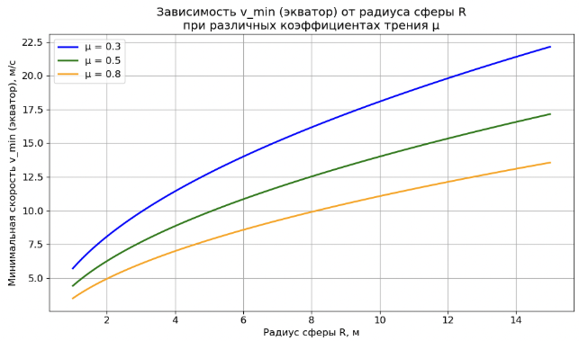

<!-- _class: title -->

# Мотоциклист в сфере

## Математические модели для решения физических задач

**Команда:** Кривошеин Алексей, Сулимов Андрей, Юдинцев Степан

---

# Цель проекта

  

  ## Основная цель:

  Исследовать движение мотоциклиста внутри сферы, определить условия устойчивого движения по экватору и необходимые параметры для выполнения трюка "сфера смерти", включая отрыв нижней части сферы.

  

  

  ## Ключевые задачи:

  - Разработать математическую модель движения.
  - Определить минимальную скорость $v_{\text{min}}$ для движения по экватору.
  - Реализовать интерактивный GUI-симулятор для визуализации и анализа.
  - Исследовать влияние параметров (радиус, трение, тяга) на движение.

  

---

# Роли в команде

- **Кривошеин Алексей:**
  - Интеграция физической модели и GUI.
  - Написание отчета и технической документации.
  - Тестирование, верификация результатов, анализ чувствительности.
- **Сулимов Андрей:**
  - Разработка графического интерфейса (PyQt5, 3D-визуализация).
  - Реализация элементов управления, отображения данных и траектории.
  - Анализ литературных источников.
- **Юдинцев Степан:**
  - Разработка динамической модели (Python).
  - Реализация физических алгоритмов (силы, интегрирование, условия отрыва/проскальзывания).
  - Численные эксперименты и подбор параметров интегратора.

---

# Анализ литературы

- **Ключевые источники:**
  - Ландау, Лифшиц "Механика" — фундаментальные принципы.
  - Goldstein "Classical Mechanics" — углубленный лагранжев формализм.
  - Статьи McDonald K.T., Abramowicz M.A. — специфика движения в сфере.
  - Журнал «Квант», Downey A.B. "Modeling and Simulation" — практические подходы.
- **Влияние на работу:**
  - Подтверждение теоретических формул ($v_{\text{min}}$).
  - Понимание важности учета трения и динамики.
  - Обоснование выбора численных методов и подходов к моделированию.

---
<!-- _class: section-break gray -->

# Математическая модель и Алгоритмы

---

# Выбор подходов, алгоритмов и структур данных

- **Физическая модель:**
  - Ньютоновская механика для описания сил.
  - Лагранжев формализм для верификации и анализа устойчивости.
- **Численный метод:**
  - **Метод Эйлера:**
    - Выбран, как наиболее простой и надежный в реализации.
- **Интерактивность:**
  - **PyQt5 для GUI:** 3D-визуализация и управление параметрами.

- **Ключевые алгоритмы:**
  - **Итерационное интегрирование ОДУ:** Эйлер для пошагового расчета $\mathbf{r}(t), \mathbf{v}(t)$.
  - **Проверка условий:** Алгоритмы для детекции отрыва ($N \le 0$) и проскальзывания ($F_{\text{трения}} > \mu_s N$).
  - **Коррекция траектории:** Обеспечение нахождения точки на поверхности сферы.

---

<!-- _class: split-left-text -->

# Входные данные модели

- **Геометрия:** Радиус сферы $R$ (м).
- **Объект:** Масса мотоциклиста $m$ (кг) (моделируется как материальная точка).
- **Силы:**
    - Коэффициент статического трения $\mu_s$.
    - Сила тяги двигателя $F_{\text{drive}}$ (Н) или $a_{\text{e}}$ (м/с²).
- **Симуляция:**
    - Общее время симуляции $T_{\text{sim}}$ (с).
    - Шаг интегрирования $\Delta t$ (с).
- **Начальные условия:**
    - Позиция $\mathbf{r}_0$ на сфере.
    - Скорость $\mathbf{v}_0$.

---

<!-- _class: split-left-text -->

# Параметры модели

- **Динамика:**
    - Траектория движения $\mathbf{r}(t)$.
    - Вектор скорости $\mathbf{v}(t)$ и скалярная скорость $v(t)$.
    - Сила нормальной реакции $N(t)$.
- **Критические значения:**
    - Минимальная скорость $v_{\text{min}}$ для удержания на экваторе.
    - Минимальная начальная скорость $v_{0,\text{min}}$ для "мертвой петли".
- **События:**
    - Момент и условия отрыва от поверхности.

---

# Математическая модель: Уравнения

Основное уравнение движения (2-й закон Ньютона):
$$m\ddot{\mathbf{r}} = \mathbf{F}_{\text{gravity}} + \mathbf{F}_{\text{drive}} + \mathbf{F}_{\text{friction}} + \mathbf{N}$$
где $\mathbf{N}$ – сила нормальной реакции, $\mathbf{F}_{\text{friction}}$ – сила трения.

**Сила нормальной реакции (для движения по окружности в верт. плоскости):**
$$N = m\frac{v^2}{R} - mg\cos\theta$$

**Условие отсутствия проскальзывания:**
$$|\mathbf{F}_{\text{friction}}| \le \mu_s N$$

**Критическая скорость на экваторе (без соскальзывания вниз):**
$$v_{\text{min, equator}} = \sqrt{\frac{gR}{\mu_s}}$$

---

<!-- _class: bg-split -->

  <video width="600" controls>
    <source src="motorcycle_images/1_720p.mov" type="video/mp4">
  </video>

# Сравнение моделей

**Статическая модель (анализ равновесия):**
- Рассматривает силы в конкретной точке
- Позволяет вывести аналитические формулы
- не описывает переходные процессы, разгон

**Динамическая модель (симуляция):**
- Описывает эволюцию системы во времени: $\mathbf{r}(t), \mathbf{v}(t)$.
- Учитывает инерцию, изменение скорости
- Позволяет моделировать:
    - Разгон до нужной скорости.
    - Движение по сложным траекториям ("мертвая петля").
    - Условия отрыва от поверхности.
    - Влияние тяги двигателя.

---
<!-- _class: section-break gray -->

# Результаты симуляции и GUI

---

# Количественные результаты и верификация

**Проверка теоретических предсказаний:**
- $v_{\text{min, equator}} = \sqrt{gR/\mu_s}$: Симуляции подтвердили эту формулу для разных $R$ и $\mu_s$.
- "Мертвая петля" (без тяги, старт снизу): $v_{0, \text{min}} \approx \sqrt{5gR}$. Симуляция показала отрыв при меньших скоростях.

---

<!-- _class: bg-split -->

  

# Основные результаты проекта

- **Разработана и реализована** динамическая модель движения мотоциклиста в сфере.
- **Создан интерактивный GUI-симулятор** на Python (PyQt5) с 3D-визуализацией, позволяющий:
    - Задавать параметры системы ($R, m, \mu_s, F_{\text{drive}}$).
    - Наблюдать траекторию движения в реальном времени.
    - Отслеживать критические события (отрыв, падение).
- **Проведена верификация модели:** Результаты симуляции согласуются с теоретическими расчетами и известными физическими пределами.
- **Выполнен анализ влияния параметров** на устойчивость и возможность выполнения трюков.
- Проект демонстрирует применение **алгоритмов численного интегрирования, обработки событий и структур данных** для решения физических задач.

---
<!-- _class: section-break -->

# Спасибо за внимание!

**Готовы ответить на ваши вопросы.**