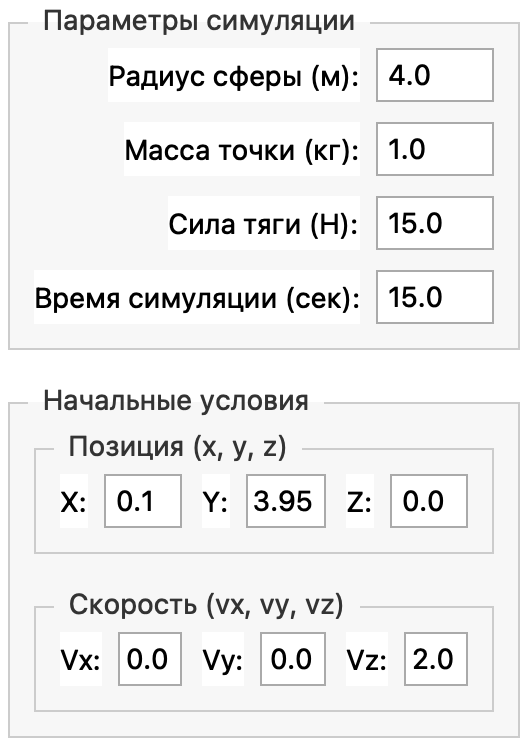
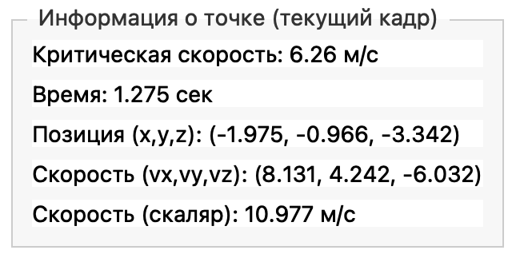
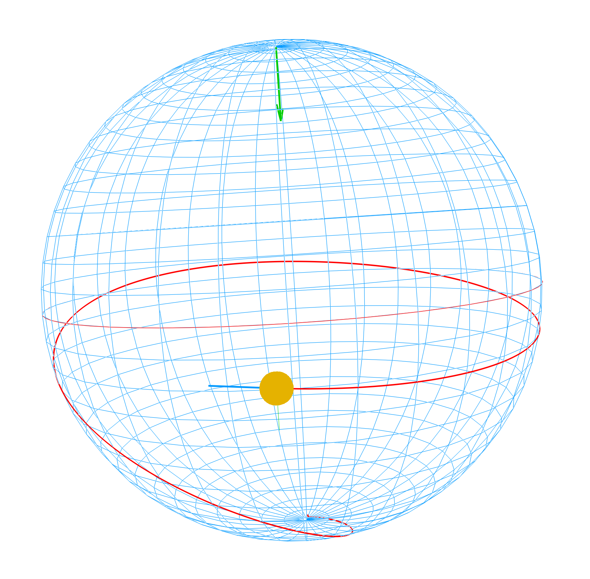

<!-- _class: title -->

# Мотоциклист в сфере

## Математические модели для решения физических задач

**Команда:** Кривошеин Алексей, Сулимов Андрей, Юдинцев Степан

---

# Цель проекта

  

  ## Основная цель:

  Старый цирковой номер - в шар въезжает мотоциклист и начинает разгонять мотоцикл, так что в конце концов мотоцикл движется по экватору шара. После этого нижняя часть шара отделяется. Какая минимальная скорость мотоцикла для этого требуется.

  

  

  ## Ключевые задачи:

  - Определение минимальной скорости для устойчивого движения.  
  - Исследование условий отрыва нижней части сферы.  
  - Предоставление пользователю возможности изменять параметры (масса, радиус, трение и т.д.) и визуализировать результаты.  

  

---

# Роли в команде

- **Кривошеин Алексей:**  
  - Интеграция модели и GUI.  
  - Написание отчетов и документации.  
  - Тестирование и верификация результатов.  
- **Сулимов Андрей:**  
  - Разработка графического интерфейса (PyQt5, 3D-визуализация).  
  - Реализация элементов управления и отображения данных.
  - Анализ источников  
- **Юдинцев Степан:**  
  - Разработка динамической модели (Python, численные методы).  
  - Реализация физических алгоритмов (силы, отрыв, коррекция траектории). 

---

# Анализ литературы

- **Ключевые источники:**  
  - Ландау, Лифшиц "Механика" — основы классической механики.  
  - Goldstein "Classical Mechanics" — углубленный анализ динамики.  
  - Статьи McDonald K.T. и Abramowicz M.A. — задачи о движении внутри сферы.  
  - Журнал «Квант» — практические примеры и аналогичные задачи.  
- **Как литература повлияла на работу:**  
  - Подтвердила корректность формулы минимальной скорости.  
  - Показала важность учета трения для движения выше экватора.  
  - Вдохновила на переход от статической к динамической модели. 
  
---
<!-- _class: section-break gray -->

# Математическая модель

---

# Выбор алгоритмов и методов

- **Ньютоновская механика:**  
  Выбрана как базовая модель для простоты и наглядности. Позволяет быстро проверить гипотезы.  
- **Лагранжев формализм:**  
  Использован для верификации результатов и учета геометрических ограничений.  
- **Численный метод Semi-implicit Euler:**  
  Выбран для динамической модели из-за устойчивости и простоты реализации. Позволяет шаг за шагом рассчитывать траекторию.  
- **PyQt5 для GUI:**  
  Обеспечивает интерактивность и удобную 3D-визуализацию.  

---

<!-- _class: split-left-text -->

# Входные данные модели

Геометрия сферы: радиус сферы $R$ (м).
Масса: общую массу точки $m$
Двигательная сила: максимальная сила тяги двигателя $F_{\text{drive}}$ (Н)
Время симуляции: $T_{\text{sim}}$ (с)
Начальные условия: начальная позиция $\mathbf{r}0=(x_0,y_0,z_0)$ на внутренней поверхности сферы
начальная скорость $\mathbf{v}0=(v{x0},v{y0},v{z0})$

<!-- Путь 'img/go.png' ОТНОСИТЕЛЬНО MD файла -->

---

<!-- _class: split-left-text -->

# Выходные данные модели

Траектория движения: функция $\mathbf{r}(t)$, представление в 3D-графике
Скорость : функции $\mathbf{v}(t)$, а также скалярная скорость $v(t)=|\mathbf{v}(t)|$
Критическая минимальная скорость на экваторе: значение $v_{\text{crit}}$

<!-- Путь 'img/go.png' ОТНОСИТЕЛЬНО MD файла -->

---

# Математическая модель

Используем второй закон Ньютона:
$$m,\ddot{\mathbf{r}} = \mathbf{F}{\text{g}} + \mathbf{F}{\text{drive}} + \mathbf{F}{\text{fr}} + \mathbf{F}{\text{drag}} + \mathbf{N}$$
Нормаль:
$$\mathbf{N} = m\frac{v^2}{R} + m g \cos\phi$$
Трение:
$$|\mathbf{F}{\text{fr}}| \le \mu N$$
Критическая скорость:
$$v_{\text{min}} = \sqrt{\frac{gR}{\mu}}$$

---

<!-- _class: bg-split -->

  <!-- Изображение слева. CSS по умолчанию (object-fit: cover) заполнит панель -->
  <video width="500" controls>
    <source src="motorcycle_images/1_720p.mov" type="video/mp4">
  </video>

# Сравнение моделей

*Статическая модель*:
- Равновесие сил, нет ускорений
- Позволяет найти $v_{\text{min}}$, но не процесс

*Динамическая модель*:
- Определяет эволюцию $\mathbf{r}(t), \mathbf{v}(t)$
- Учитывает инерцию, отрыв, переходы
- Показывает реальную траекторию
- Может моделировать отрыв от стены

*Вывод*:
Динамика точнее, применима к любому моменту
Преимущественна для симуляций и анимаций

---

# Результат

<video width="900" controls>
  <source src="motorcycle_images/2_1080p.mov" type="video/mp4">
</video>

---

# Трудности и решения
- **Проблемы:**  
  - Численный дрейф при интегрировании.  
  - Физическая корректность условий отрыва.  
  - Интеграция сложной логики в GUI.  
- **Решения:**  
  - Жесткая коррекция положения точки на сфере.  
  - Введение запаса в условии отрыва ($\times 1.05$).  
  - Постепенное усложнение модели (итеративный подход).  

---

<!-- _class: bg-split -->

  <!-- Изображение слева. CSS по умолчанию (object-fit: cover) заполнит панель -->
  

# Результаты

- Реализована работоспособная динамическая модель и интерактивный GUI.  
- Получены результаты, согласующиеся с теоретическими предсказаниями.  
- Проект предоставляет удобный инструмент для анализа движения мотоциклиста в сфере.  

---

<!-- _class: section-break -->

# Спасибо за внимание!

Мы готовы ответить на ваши вопросы
